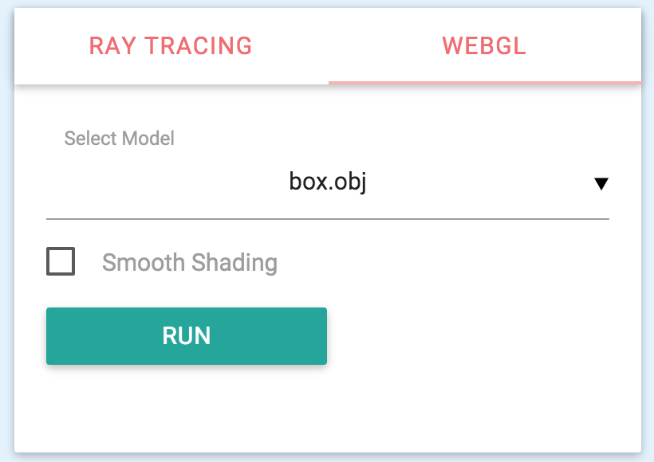
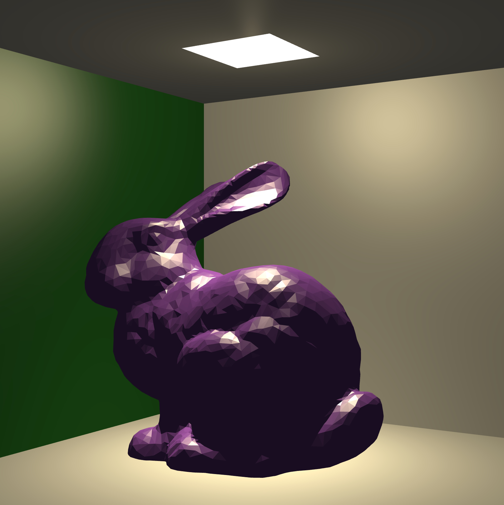
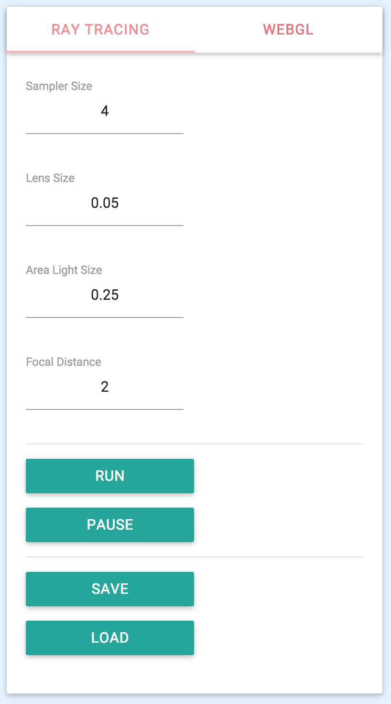
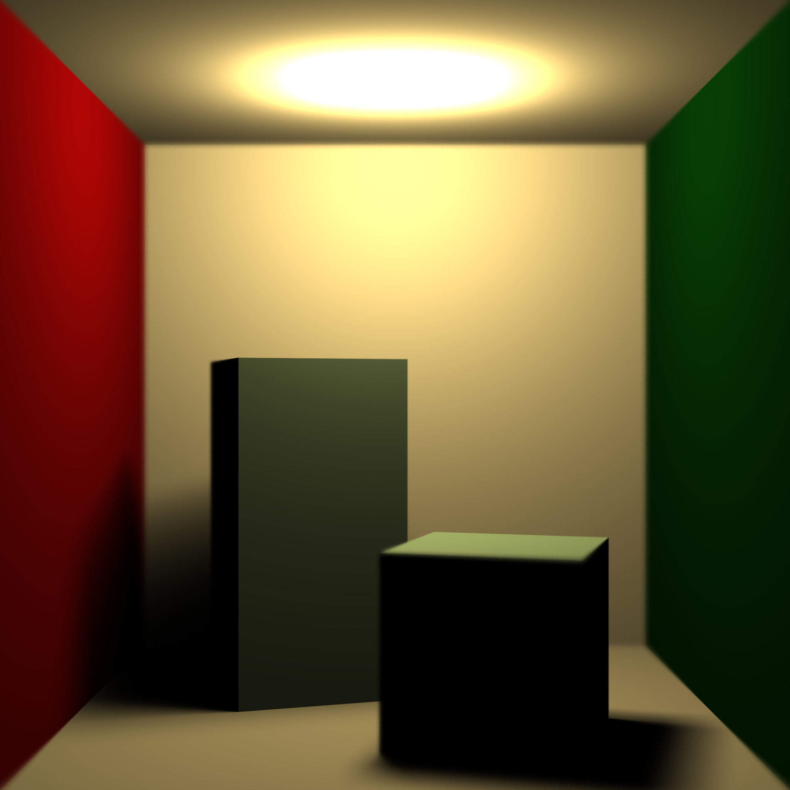
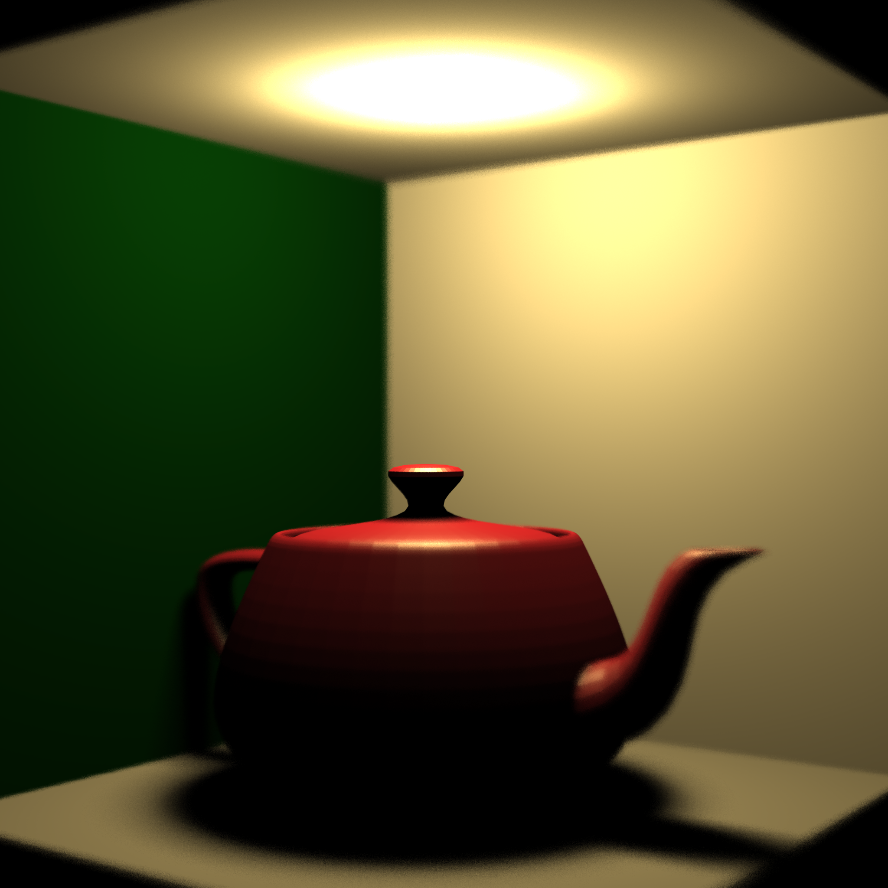
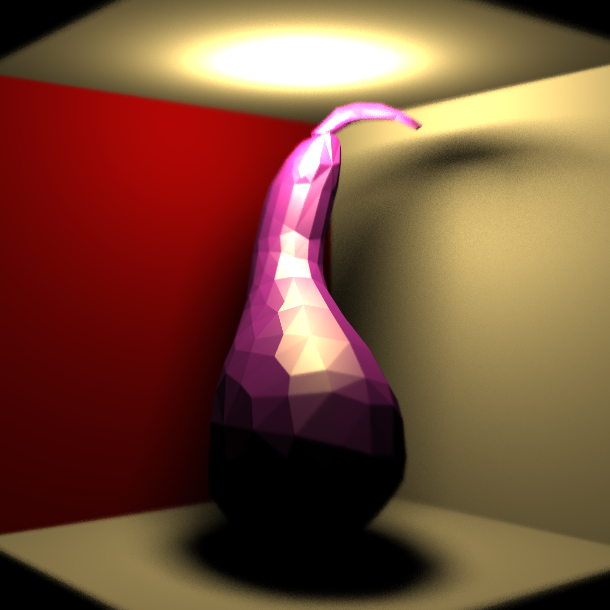

# Report of the 2<sup>nd</sup> Homework of CG Course

####Zhou Bowei
####2015.12.30

***

### 1. How to run

Run these command through CMD or bash:

```bash
cd path-to-this-folder/
python -m SimpleHTTPServer
```
Then, open [127.0.0.1:8000](http://127.0.0.1:8000/).  

Or, you can run it [online](http://b-z.github.io/ray).

### 2. How to use

* Choose a model from the listed models. Then click the "RUN" button.

<div style="text-align:center;">

</div>

* Adjust the orientation of the model.

<div style="text-align:center;">

</div>

* Open the "RAY TRACING" panel. Adjust the parameters.

<div style="text-align:center;">

</div>

* Click the "RUN" button, and have a cup of tea🍵

<div style="text-align:center;">

</div>

### 3. Advantages & Disadvantages

* Advantages:  
  * Only using JavaScript, means that you can run it on every platforms, including iOS & Android.
  * Area light
  * Depth of field
* Disadvantages
  * No global illumination
  * No refraction or reflection
  * No smooth surface
  * Inefficient (because JavaScript doesn't have mechanism of multi-thread and could not use GPU)

### 4. Gallery

<div style="text-align:center;">

</div>

<div style="text-align:center;">

</div>

<div style="text-align:center;">

</div>


